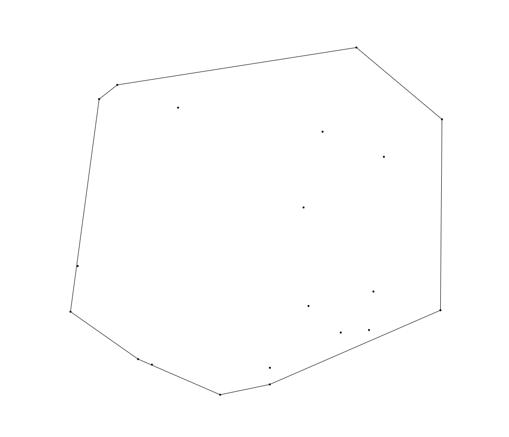

# Convex Hull

Given a Set of Points __P__ calculate the unique minimal convex Polygon __CH__, such
that all Points of __P__ are contained inside __CH__.

## example


## Usage
Assuming your Points are arrays. So for example

``` javascript
const points = [
    [10, 3],
    [15, 7],
    [3, 21],
    [9, 3]
];

const result = convexHull(points);
```

`
